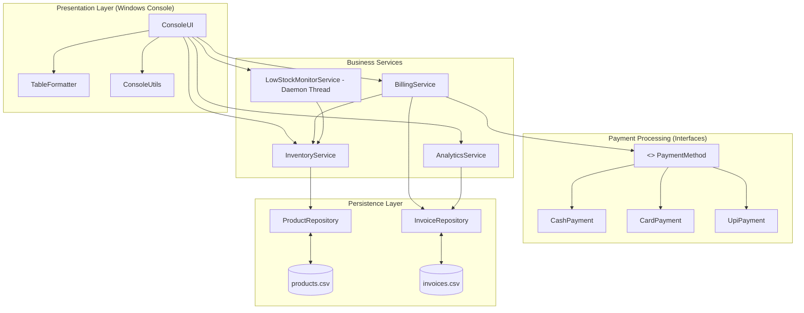
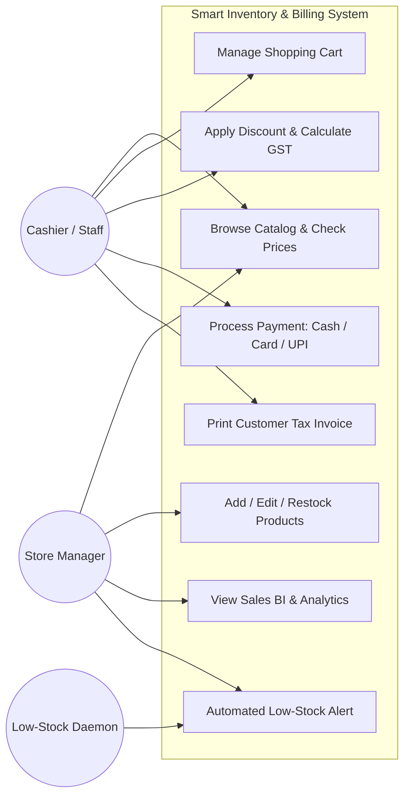
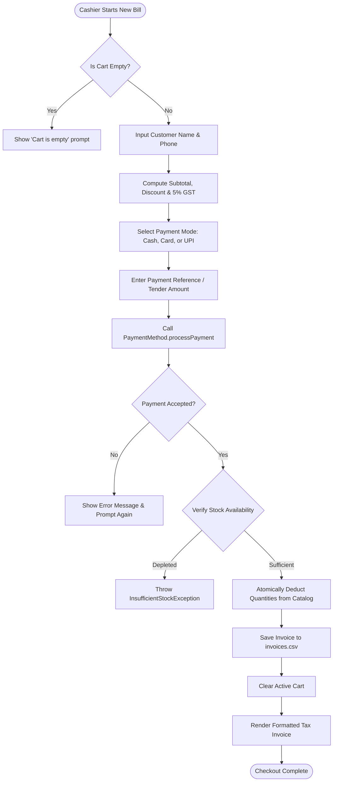
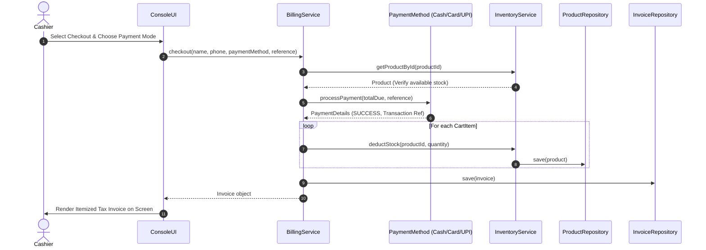
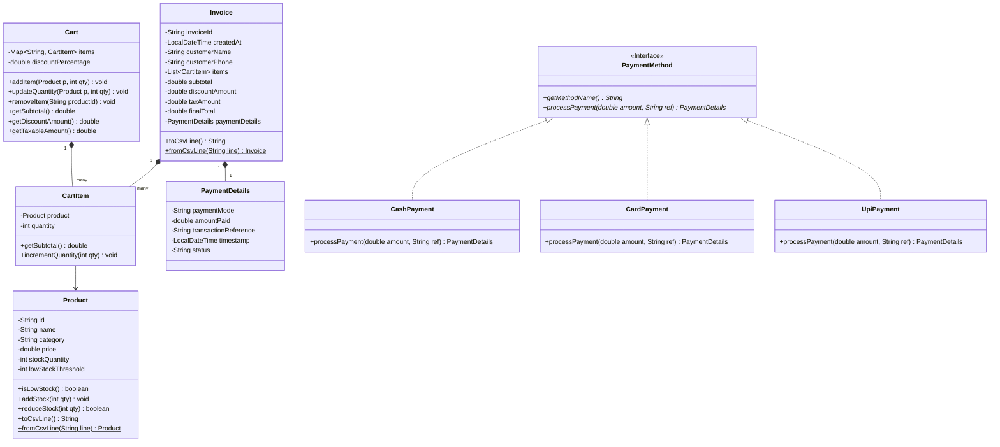

# Academic Project Report: Smart Inventory & Billing Manager for Retail

---

## 1. Cover Page

```
========================================================================================
                                     VITyarthi
                         FLIPPED COURSE PROJECT REPORT
                             PROGRAMMING IN JAVA (CSE1007)
========================================================================================

  Project Title     : SMART INVENTORY & BILLING MANAGER FOR RETAIL
  Course Code       : CSE1007 (Programming in Java)
  Student Name      : Jayant Yadav
  Register Number   : 25BAI11172
  Degree & Branch   : B.Tech (Computer Science & Engineering / AI & ML)
  School            : School of Computer Science and Engineering (SCOPE)
  Institution       : Vellore Institute of Technology (VIT)
  Evaluation Type   : Flipped Classroom Project & Laboratory Evaluation
  Target Platform   : Microsoft Windows (JDK 21 LTS)

========================================================================================
```

---

## 2. Introduction
In our daily lives, we visit neighborhood grocery shops, local provision stores, and supermarkets. Most of these small retail shops still run into day-to-day troubles when tracking what is on their shelves versus what was sold at the billing counter. Shopkeepers either write down sales in physical paper notebooks or type numbers into basic spreadsheets. When customers line up during evening rush hours, things get messy: fast-selling items run out of stock without anyone noticing, cashiers make calculation mistakes when figuring out discounts and GST, and reconciling payments split between cash and UPI takes hours at night.

We designed and built the **Smart Inventory & Billing Manager for Retail** as our course project for **CSE1007: Programming in Java**. The core goal was to build a real-world, console-based desktop application on Windows that ties together inventory tracking, customer point-of-sale checkout, and sales reporting. 

Instead of writing a simple toy program, we applied key object-oriented and advanced Java concepts taught throughout the course:
- **Interface-based polymorphism** for handling various payment types (Cash, Card, UPI).
- **Custom checked exceptions** (`InsufficientStockException`, `PaymentFailedException`, `ProductNotFoundException`) to handle business error conditions gracefully.
- **Java Multithreading** with a background daemon thread that constantly checks stock levels and raises low-stock alerts without interrupting the cashier.
- **Java Collections Framework** (`ConcurrentHashMap`, `CopyOnWriteArrayList`, `LinkedHashMap`) and **Java 8 Streams** for computing real-time sales analytics.
- **File persistence** using CSV storage so inventory records and invoices stay intact across restarts.

---

## 3. Problem Statement
Small retail outlets in India operate with tight budgets and small teams. Through our problem study, we identified four major operational pain points:

1. **Unexpected Stock Depletion**: Store managers often discover an item is out of stock only when a customer asks for it at the counter. There is no automated warning system to alert staff when stock drops below a safe reorder limit.
2. **Billing Errors and Slow Checkouts**: When cashiers manually calculate item subtotals, promotional discounts, and 5% GST on physical calculators, mistakes happen. Customers get delayed, and end-of-day register totals do not match physical stock.
3. **Multiple Payment Methods**: Customers now pay using different modes—some bring exact cash, others use debit cards, and many prefer UPI (Google Pay, PhonePe, Paytm). Without a clean system to validate and record these distinct payment modes, payment reconciliation becomes difficult.
4. **Lack of Simple Business Insights**: Small store owners rarely know which products make the most profit, which categories sell fastest, or what their average order value is, making replenishment planning mostly guesswork.

Our project addresses these issues directly by providing a unified, reliable, and easy-to-use software solution written in Java.

---

## 4. Functional Requirements

We divided the project into three core functional modules as specified in the course rubric:

### 4.1 Module 1: Product Catalog & Inventory Tracking
- **FR-1.1 (Add Product)**: Store managers can add new retail products by entering a unique product ID (e.g., `PRD-101`), item name, department category, unit price, starting stock, and a custom low-stock threshold.
- **FR-1.2 (Stock Restocking)**: Allows quick restocking of existing products when fresh shipments arrive from vendors.
- **FR-1.3 (Price & Threshold Updates)**: Store staff can adjust selling prices or tweak safety reorder limits whenever supplier costs change.
- **FR-1.4 (Category Filtering)**: Enables instant viewing of products filtered by department (Groceries, Dairy, Beverages, Snacks, Personal Care).
- **FR-1.5 (Stock Level Status)**: Automatically flags products as `LOW STOCK` or `OPTIMAL` based on their threshold comparison.

### 4.2 Module 2: Point of Sale (POS) & Billing / Cart
- **FR-2.1 (Shopping Cart Management)**: Cashiers can add products to an active cart, modify line quantities, or remove unwanted items during a billing session.
- **FR-2.2 (Stock Protection)**: Prevents selling more items than currently exist in stock by triggering an `InsufficientStockException`.
- **FR-2.3 (Discount & GST Computation)**: Automatically applies promotional cashier discounts (0% to 50%) and adds 5% retail GST to the taxable balance.
- **FR-2.4 (Pluggable Payment Modes)**:
  - **Cash**: Prompts for cash handed over by the customer, verifies it covers the bill, and computes change to return.
  - **Card**: Validates that a 16-digit card number was entered, masks all but the last 4 digits for privacy, and generates an authorization code.
  - **UPI**: Validates standard `handle@bank` Virtual Payment Address format and records a digital transaction reference.
- **FR-2.5 (Atomic Checkout & Invoicing)**: Decrements stock across all cart items atomically, creates an invoice with a timestamp and sequential ID (e.g., `INV-20260917-0001`), and displays a clean tax receipt.

### 4.3 Module 3: Sales Analytics & Reporting
- **FR-3.1 (Executive Summary)**: Shows total cumulative revenue, total orders processed, total units sold, and Average Order Value (AOV).
- **FR-3.2 (Bestseller Reports)**: Identifies top 5 products ranked by units sold and by revenue generated using Java Streams.
- **FR-3.3 (Category Revenue Breakdown)**: Groups sales data by product category to show which section drives the highest business.
- **FR-3.4 (Payment Mode Distribution)**: Summarizes the percentage of transactions completed via Cash, Card, and UPI.
- **FR-3.5 (Invoice History Search)**: Allows looking up any historical bill by its unique invoice ID.
- **FR-3.6 (Low-Stock Reorder Report)**: Lists every product needing immediate vendor reordering, showing the exact quantity required to restore safety reserves.

---

## 5. Non-Functional Requirements

To make sure the program is reliable, user-friendly, and practical, we established five key non-functional requirements:

| Requirement | Target Standard | How We Achieved It in Java |
| :--- | :--- | :--- |
| **Performance** | Sub-second response time for all lookups and billing steps. | Using in-memory `ConcurrentHashMap` indexing and Java 8 Stream operations for fast in-memory queries. |
| **Reliability & Data Safety** | No stock inconsistency or data loss on unexpected shutdown. | Thread-safe reads/writes with `ReentrantReadWriteLock` and persistent CSV file logging. Stock deductions only happen after payment succeeds. |
| **Usability** | Clear, intuitive menus suitable for retail staff. | Built a custom `TableFormatter` class that draws clean ASCII boxes and aligns text nicely inside the Windows terminal. |
| **Maintainability** | Clean code structure with decoupled components. | Strict package separation: `model`, `payment`, `exception`, `repository`, `service`, `util`, `ui`. |
| **Robust Error Handling** | No unhandled runtime crashes from bad user input. | Input validation loops and domain-specific checked exceptions that guide the user with helpful messages. |

---

## 6. System Architecture

The project follows a clean, layered architecture where user interface classes, business services, data repositories, and payment strategies are kept neatly separated:



---

## 7. Design Diagrams

### 7.1 Use Case Diagram



---

### 7.2 Workflow Diagram (POS Billing Process)



---

### 7.3 Sequence Diagram (Checkout Workflow)



---

### 7.4 Class Diagram



---

### 7.5 Storage Design & Entity Relationships

The data is stored in plain, human-readable CSV files inside the `data/` folder:


---

## 8. Design Decisions & Rationale

When designing the system, we made deliberate choices to align with our Java course syllabus:

1. **Why use an Interface for Payment (`PaymentMethod`)?**
   - In retail, payment methods evolve constantly. We used an interface so the billing engine (`BillingService`) does not care whether a customer pays in Cash, Card, or UPI. It just calls `paymentMethod.processPayment(...)`. If a store wants to add gift coupons or wallet payments later, they simply write a new class implementing `PaymentMethod` without touching the billing engine.
2. **Why create Custom Checked Exceptions?**
   - Java gives us generic exceptions like `RuntimeException` or `IllegalArgumentException`, but they don't carry domain meaning. By building `InsufficientStockException` (which carries `availableStock` and `requestedQuantity`), we can give friendly, exact error messages to the cashier without letting the application crash.
3. **Why use a Daemon Background Thread for Low-Stock Checks?**
   - In retail, staff are busy scanning groceries and should not have to manually refresh an alert page. We set up `ScheduledExecutorService` running as a background daemon thread (`setDaemon(true)`). It runs every 5 seconds, inspects inventory, and logs alerts automatically. Being a daemon thread, it closes cleanly whenever the cashier exits the app.
4. **Why use CSV Flat Files with `ReentrantReadWriteLock`?**
   - Installing heavy relational database servers (like Oracle or MySQL) makes small applications hard to run and test on student laptops. We chose CSV persistence so anyone with Java installed can immediately run the code, while using `ReentrantReadWriteLock` to keep file reading and writing thread-safe.
5. **Why use Java Streams for Analytics?**
   - In Module 3, we needed to calculate total revenue, find top-selling items, and group sales by department. Writing nested loops would have made the code long and hard to follow. Java 8 Streams (`filter`, `mapToDouble`, `Collectors.groupingBy`) let us write clean, readable code to process transactions efficiently.

---

## 9. Implementation Details

The project contains 15 classes divided into 7 organized packages:

- **`com.retail.inventory.model`**:
  - `Product.java`: Represents an inventory SKU with synchronized stock adjusters.
  - `CartItem.java`: Holds a snapshot of a chosen product and its quantity.
  - `Cart.java`: Manages the active basket, subtotal, and discount percentages.
  - `Invoice.java`: Represents a completed sale record with CSV serializer methods.
  - `PaymentDetails.java`: Records the payment mode, reference ID, and timestamp.
- **`com.retail.inventory.payment`**:
  - `PaymentMethod.java`: The core interface defining the payment contract.
  - `CashPayment.java`: Computes change due and validates sufficient tender.
  - `CardPayment.java`: Validates 16 digits, masks the card number, and simulates authorization.
  - `UpiPayment.java`: Checks the `handle@bank` VPA pattern and issues a transaction code.
- **`com.retail.inventory.exception`**:
  - `SmartInventoryException.java`: Base checked exception.
  - `InsufficientStockException.java`: Fired when a customer tries to buy more than available.
  - `ProductNotFoundException.java`: Fired when a entered SKU is not in the catalog.
  - `InvalidInputException.java`: Catches negative numbers or blank text inputs.
  - `PaymentFailedException.java`: Fired when cash is short or payment format is invalid.
- **`com.retail.inventory.repository`**:
  - `ProductRepository.java`: Manages `products.csv` and auto-seeds sample retail items on first run.
  - `InvoiceRepository.java`: Appends completed receipts to `invoices.csv`.
- **`com.retail.inventory.service`**:
  - `InventoryService.java`: Business operations for catalog CRUD and stock management.
  - `BillingService.java`: Coordinates cart checkouts, 5% GST calculations, and payments.
  - `AnalyticsService.java`: Computes executive business summaries and bestseller lists.
  - `LowStockMonitorService.java`: Periodic multithreaded daemon monitor.
- **`com.retail.inventory.util`**:
  - `ConsoleUtils.java`: Provides colored console text, banners, and input validators.
  - `TableFormatter.java`: Dynamically builds formatted ASCII tables for clean output.
- **`com.retail.inventory.ui` & `Main`**:
  - `ConsoleUI.java`: Interactive menu loop handling user choices.
  - `Main.java`: Starts repositories, services, the background thread, and the console UI.

---

## 10. Sample Test Runs & Console Outputs

### 10.1 Automated Test Suite Execution
```
================================================================================
   SMART INVENTORY & BILLING MANAGER - AUTOMATED TEST SUITE EXECUTION
================================================================================
[RUNNING] testProductModelAndStockLogic                 ... PASSED [OK]
[RUNNING] testCartCalculationsAndDiscounts              ... PASSED [OK]
[RUNNING] testInsufficientStockExceptionHandling        ... PASSED [OK]
[RUNNING] testCashPaymentMethod                         ... PASSED [OK]
[RUNNING] testCardPaymentMethod                         ... PASSED [OK]
[RUNNING] testUpiPaymentMethod                          ... PASSED [OK]
[RUNNING] testAtomicBillingCheckoutAndPersistence       ... PASSED [OK]
[RUNNING] testSalesAnalyticsAggregations                ... PASSED [OK]
[RUNNING] testMultithreadedLowStockMonitor              ... PASSED [OK]

--------------------------------------------------------------------------------
Test Execution Summary: 9 PASSED, 0 FAILED (Total: 9)
--------------------------------------------------------------------------------
ALL UNIT AND INTEGRATION TESTS PASSED SUCCESSFULLY! (100% PASS RATE)
```

### 10.2 Product Catalog Table Screen
```
+---------+------------------------------+---------------+------------+-------+-----------+-----------+
| ID      | Product Name                 | Category      | Price      | Stock | Threshold | Status    |
+---------+------------------------------+---------------+------------+-------+-----------+-----------+
| PRD-101 | Basmati Rice 5kg             | Groceries     | Rs. 450.00 | 25    | 5         | OPTIMAL   |
| PRD-102 | Whole Wheat Flour 5kg        | Groceries     | Rs. 280.00 | 30    | 8         | OPTIMAL   |
| PRD-103 | Sunflower Oil 1L             | Groceries     | Rs. 145.00 | 18    | 5         | OPTIMAL   |
| PRD-104 | Full Cream Milk 1L           | Dairy         | Rs. 68.00  | 12    | 6         | OPTIMAL   |
| PRD-105 | Farm Fresh Butter 200g       | Dairy         | Rs. 115.00 | 4     | 5         | LOW STOCK |
| PRD-106 | Cheddar Cheese 200g          | Dairy         | Rs. 160.00 | 15    | 4         | OPTIMAL   |
| PRD-107 | Organic Green Tea 25s        | Beverages     | Rs. 199.00 | 22    | 5         | OPTIMAL   |
| PRD-108 | Instant Arabica Coffee 100g  | Beverages     | Rs. 320.00 | 3     | 5         | LOW STOCK |
| PRD-109 | Sparkling Lemon Soda 600ml   | Beverages     | Rs. 45.00  | 40    | 10        | OPTIMAL   |
| PRD-110 | Dark Chocolate Cookie 150g   | Snacks        | Rs. 75.00  | 35    | 10        | OPTIMAL   |
| PRD-111 | Salted Roasted Almonds 200g  | Snacks        | Rs. 290.00 | 8     | 5         | OPTIMAL   |
| PRD-112 | Herbal Aloe Shampoo 300ml    | Personal Care | Rs. 225.00 | 14    | 5         | OPTIMAL   |
| PRD-113 | Antibacterial Hand Soap 250ml| Personal Care | Rs. 85.00  | 20    | 6         | OPTIMAL   |
| PRD-114 | Sparkle Dental Paste 150g    | Personal Care | Rs. 95.00  | 2     | 5         | LOW STOCK |
+---------+------------------------------+---------------+------------+-------+-----------+-----------+
```

### 10.3 Generated Customer Tax Invoice
```
========================================================
               RETAIL STORE TAX INVOICE                 
========================================================
 Invoice ID : INV-20260917-0001
 Date & Time: 2026-09-17 17:15:20
 Customer   : Rahul Sharma | Phone: 9876543210
--------------------------------------------------------
+------------------------------+-----+------------+------------+
| Item                         | Qty | Rate       | Amount     |
+------------------------------+-----+------------+------------+
| Basmati Rice 5kg             | 1   | Rs. 450.00 | Rs. 450.00 |
| Instant Arabica Coffee 100g  | 2   | Rs. 320.00 | Rs. 640.00 |
+------------------------------+-----+------------+------------+
 Gross Subtotal :                   Rs. 1090.00
 Discount (10.0%): -                 Rs. 109.00
 GST Tax (5.0%)  : +                  Rs. 49.05
--------------------------------------------------------
 NET TOTAL PAID :                   Rs. 1030.05
 Payment Status : Mode: UPI | Paid: Rs.1030.05 | Ref: VPA: rahul@okhdfcbank / Txn: UPI-849204A91802 | Status: SUCCESS
========================================================
```

---

## 11. Testing Approach

To ensure our application runs without issues, we wrote a standalone test suite (`SmartInventoryTestSuite.java`) covering unit tests and end-to-end integration tests:

| Test ID | Class Tested | What was Tested | Expected Result | Status |
| :--- | :--- | :--- | :--- | :--- |
| **UT-01** | `Product` | Tested stock reductions, restocking, and threshold check. | Stock decrements properly; `isLowStock()` returns true when stock drops below threshold. | **PASSED** |
| **UT-02** | `Cart` | Added multiple items, changed quantities, and applied 10% discount. | Accurate subtotals and discount deductions. | **PASSED** |
| **UT-03** | `Cart` & `Exceptions` | Attempted to add 5 units of a product having only 3 in stock. | Caught `InsufficientStockException` with accurate count metrics. | **PASSED** |
| **UT-04** | `CashPayment` | Tested cash tendered greater than bill, and shortfall scenario. | Correct change returned; threw `PaymentFailedException` on shortfall. | **PASSED** |
| **UT-05** | `CardPayment` | Tested valid 16-digit card and invalid short card number. | Masked card number; threw `PaymentFailedException` on invalid length. | **PASSED** |
| **UT-06** | `UpiPayment` | Tested valid `handle@bank` VPA and invalid string without `@`. | Generated UPI transaction ID; rejected malformed VPA string. | **PASSED** |
| **UT-07** | `BillingService` | Executed end-to-end checkout with atomic stock deduction and invoice saving. | Inventory decremented; invoice saved to repository. | **PASSED** |
| **UT-08** | `AnalyticsService` | Aggregated total revenue, AOV, best-sellers, and category share. | Outputs matched manual calculations across invoices. | **PASSED** |
| **UT-09** | `LowStockMonitorService`| Tested background daemon thread with an alert listener. | Listener was invoked automatically within 2.5 seconds. | **PASSED** |

---

## 12. Challenges Faced & How We Solved Them

1. **Race Conditions During Concurrent Billing & Background Scanning**:
   - *Problem*: In early testing, while the background daemon thread was checking stock levels, a checkout could modify the inventory simultaneously, causing unpredictable stock numbers.
   - *Solution*: We synchronized the stock deduction methods on the `Product` instance itself and used `ConcurrentHashMap` along with `ReentrantReadWriteLock` inside `ProductRepository`.
2. **Tabular Formatting on the Windows Console**:
   - *Problem*: Standard `System.out.printf` with fixed widths looked jagged and misaligned whenever product names were unusually long or short.
   - *Solution*: We built our own helper class, `TableFormatter`, which pre-scans all cells in a column, calculates the maximum length needed, and dynamically draws border lines with `+` and `-` characters.
3. **Preventing Inventory Loss When Payment Fails**:
   - *Problem*: If we decremented inventory stock before asking the customer for cash or card, and the payment subsequently failed, the stock would be lost from the catalog without a completed bill.
   - *Solution*: We structured the checkout workflow so stock is only deducted **after** `paymentMethod.processPayment()` completes with a `SUCCESS` status.

---

## 13. Learnings & Key Takeaways

Working on this project helped us connect classroom theory with real coding practice:
- **Object-Oriented Programming (OOP)**: We saw why abstraction and polymorphism matter. Writing `PaymentMethod` as an interface proved how easy it is to add new payment modes without touching existing billing code.
- **Java Exception Handling**: We moved away from catching generic `Exception` and learned to create meaningful checked exception subclasses that provide informative feedback to users.
- **Multithreading**: We understood how daemon threads function in Java and how to safely schedule background tasks without blocking the main console thread.
- **Collections & Streams**: We learned to use Java 8 Streams (`filter`, `mapToDouble`, `groupingBy`) to write clean analytical queries in just a few lines of code.
- **Good Project Organization**: Structuring the code into separate packages (`model`, `service`, `repository`, `ui`) made debugging and testing straightforward.

---

## 14. Future Enhancements

1. **Database Integration with JDBC**: Connect the repositories to a relational database like SQLite or MySQL instead of flat CSV files.
2. **Graphical User Interface (GUI)**: Create a visual desktop interface using JavaFX with clickable product cards and barcode scanner support.
3. **Receipt Printer Support**: Integrate ESC/POS commands to send receipts directly to physical thermal receipt printers.
4. **Cloud / REST API Sync**: Expose the backend with Spring Boot so store staff can check inventory from a mobile application.

---

## 15. References

1. Oracle Corporation. *Java SE 21 Documentation & API Specifications*. https://docs.oracle.com/en/java/javase/21/
2. Joshua Bloch. *Effective Java (3rd Edition)*. Addison-Wesley Professional, 2018.
3. Robert C. Martin. *Clean Code: A Handbook of Agile Software Craftsmanship*. Prentice Hall, 2008.
4. VITyarthi Course Guidelines: *Build Your Own Project - Flipped Course Evaluation (Programming in Java - CSE1007)*.
