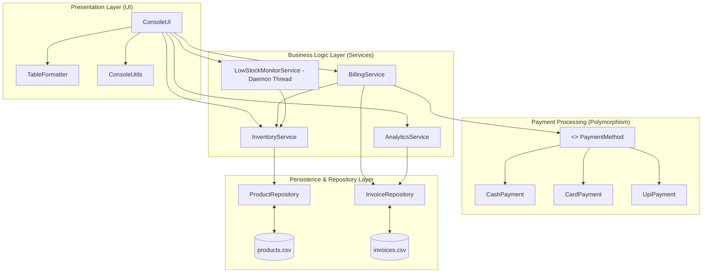
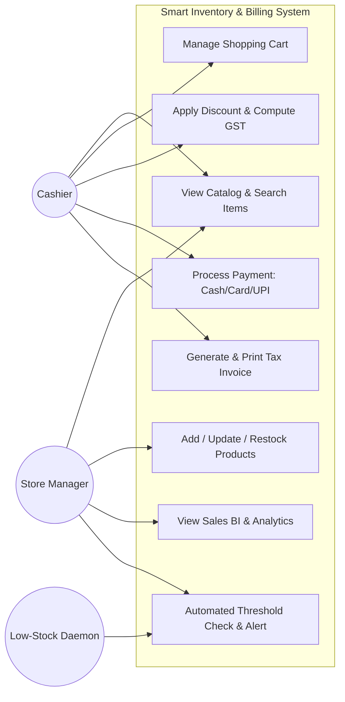
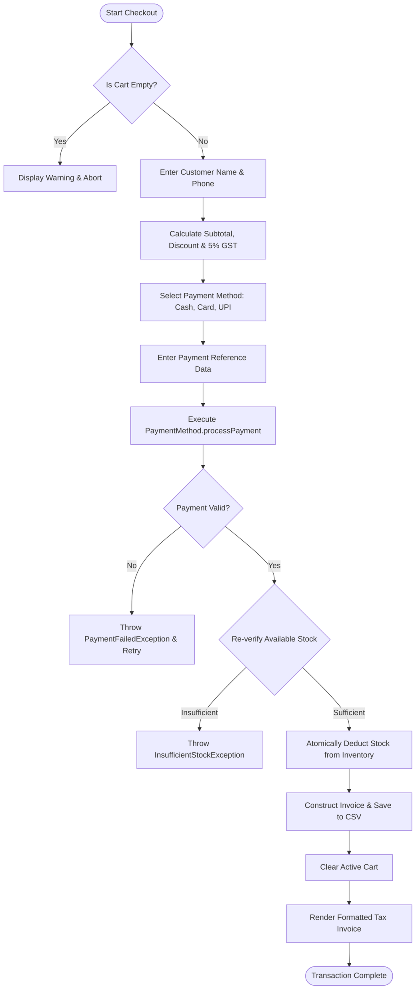
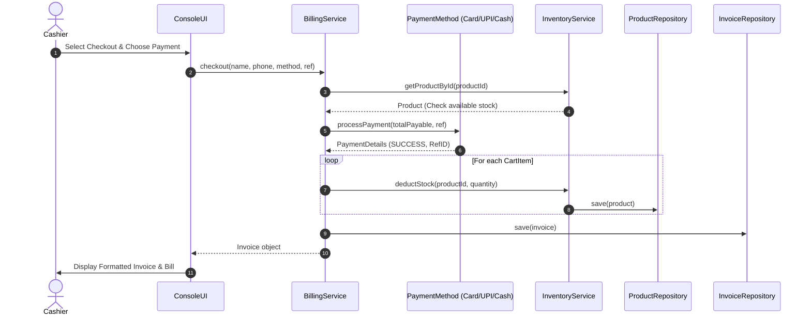
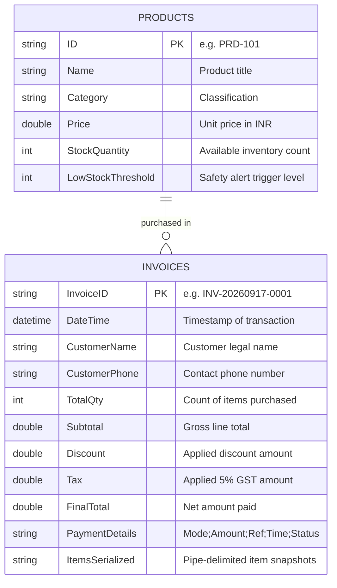

# Project Report: Smart Inventory & Billing Manager for Retail

---

## 1. Cover Page

```
========================================================================================
                                     VITyarthi
                         FLIPPED COURSE PROJECT REPORT
                             PROGRAMMING IN JAVA
========================================================================================

             Project Title: SMART INVENTORY & BILLING MANAGER FOR RETAIL
             Course Code  : CSE1007 / Programming in Java
             Domain       : Core Java, Object-Oriented Software Engineering, POS Retail Systems
             Submission   : Flipped Evaluation Project & Laboratory Submission

========================================================================================
```

---

## 2. Introduction
In today's fast-paced retail industry, small and medium enterprises (SMEs) such as convenience stores, supermarkets, grocery outlets, and pharmacies require rapid, accurate, and dependable inventory tracking and customer checkout systems. Relying on manual ledgers or decoupled software causes discrepancy between ledger figures and shelf stock, missed restock triggers, queue delays during peak checkout hours, and errors in calculating sales tax and promotional discounts.

The **Smart Inventory & Billing Manager for Retail** is an integrated software system developed in **Java 21 (LTS)** designed to automate the entire sales and stock cycle. The software links product catalog administration, Point-of-Sale (POS) customer cart transactions, and business analytics into a unified console environment. By applying core Java paradigms—such as **Interface-driven polymorphism**, **Custom Checked Exception Handling**, **Multithreaded Background Daemon Monitoring**, **Collections Framework**, and **Java 8+ Functional Streams**—the system guarantees data consistency, zero-dependency persistence, and high execution speed.

---

## 3. Problem Statement
Small-scale brick-and-mortar retailers operate with constrained margins and lean staffing. They encounter four critical recurring operational bottlenecks:

1. **Unmonitored Stockouts & Inventory Spoilage**: High-velocity products frequently run out of stock without prior notification. Conversely, over-ordering slow-moving inventory ties up capital.
2. **Checkout Inaccuracies & Billing Bottlenecks**: Manually calculating line-item totals, applicable Goods and Services Tax (GST), and promotional discounts under high customer pressure leads to financial discrepancies and long customer wait times.
3. **Multi-Channel Payment Reconciliation**: Customers increasingly split their purchases across Cash, Credit/Debit cards, and UPI apps. Without an extensible payment interface and unified ledger, end-of-day reconciliation is slow and prone to errors.
4. **Lack of Actionable Sales Intelligence**: Small retailers often lack visibility into which products generate the highest revenue, what their average transaction value is, or which categories perform best.

The objective of this project is to implement a robust, reliable, and object-oriented software system that resolves these challenges through automated real-time inventory tracking, flexible multi-channel billing, autonomous background stock health monitoring, and stream-powered business analytics.

---

## 4. Functional Requirements

The system is architected around three major functional modules as specified by the course rubric:

### 4.1 Module 1: Product Catalog & Inventory Tracking
- **FR-1.1 (Product Management)**: Ability to add new products with SKU ID, product name, category, unit price, available stock quantity, and minimum safety threshold.
- **FR-1.2 (Stock Replenishment)**: Ability to update existing inventory counts when new supplier consignments arrive.
- **FR-1.3 (Price & Threshold Modification)**: Ability to modify retail pricing and adjust low-stock trigger limits dynamically.
- **FR-1.4 (Category-Based Filtering)**: Search and view catalog items filtered by department or category (e.g., Groceries, Dairy, Beverages, Personal Care).
- **FR-1.5 (Real-Time Stock Query)**: Instantaneous evaluation of whether a given product is optimal or breached below its safety threshold.

### 4.2 Module 2: Point of Sale (POS) & Customer Billing
- **FR-2.1 (Cart Lifecycle Management)**: Ability to create a customer shopping session, add products, adjust item quantities, or remove items.
- **FR-2.2 (Oversell Prevention)**: Immediate validation ensuring requested quantities do not exceed available stock, throwing custom `InsufficientStockException`.
- **FR-2.3 (Automated Price & Tax Computation)**: Automatic computation of subtotal, cashier promotional discount percentage, and configurable tax/GST rate.
- **FR-2.4 (Polymorphic Payment Settlement)**: Extensible payment interface accepting:
  - **Cash Payment**: Tendered cash input, exact change computation, and shortfall checks.
  - **Card Payment**: Card number validation (16 digits), security masking (`****-****-****-1234`), and authorization code generation.
  - **UPI Payment**: Virtual Payment Address (VPA) format verification (`handle@bank`) and transaction reference generation.
- **FR-2.5 (Atomic Inventory Deduction & Receipt Generation)**: Deduct stock across all purchased items atomically upon successful payment, create an itemized invoice, and print a formatted tax receipt.

### 4.3 Module 3: Sales Analytics & Reporting
- **FR-3.1 (Executive Sales Summary)**: Aggregates total gross revenue, total completed orders, total units sold, and Average Order Value (AOV).
- **FR-3.2 (Top-Selling Products Analysis)**: Ranks products by units sold and by total revenue generated.
- **FR-3.3 (Category-Wise Revenue Share)**: Calculates total financial sales breakdown grouped by category.
- **FR-3.4 (Payment Channel Breakdown)**: Summarizes distribution of payment modes chosen by customers.
- **FR-3.5 (Audit Trail Query)**: Fast lookup of past historical invoices using unique invoice serial codes.
- **FR-3.6 (Low-Stock Reorder Checklist)**: Generates a prioritized procurement reorder list indicating units required to restore stock to twice the safety threshold.

---

## 5. Non-Functional Requirements

To ensure software excellence, the project fulfills the following core non-functional requirements:

| Dimension | Specification | Implementation Strategy |
| :--- | :--- | :--- |
| **1. Performance** | Sub-millisecond response times for in-memory stock checks, cart calculations, and analytical queries. | In-memory indexing via `ConcurrentHashMap` and linear-time Java Stream aggregations. |
| **2. Reliability & Data Integrity** | Zero data loss or corruption across sudden system restarts or crashes; atomic stock deductions during checkout. | CSV file persistence backed by `ReentrantReadWriteLock` and atomic block deductions ensuring cart checkouts are all-or-nothing. |
| **3. Usability & Interface Clarity** | Clear, intuitive text-based console interface with color-coded alerts, structured ASCII data tables, and input prompts. | `ConsoleUtils` and `TableFormatter` utility classes providing clear visual hierarchy and menu navigation. |
| **4. Maintainability & Modularity** | Clean separation of concerns following MVC-like layered architecture with distinct model, service, repository, and UI packages. | Minimum coupling; business services communicate through repository abstractions and interfaces. |
| **5. Robust Error Handling** | No unhandled runtime exceptions or abrupt process crashes resulting from bad user input or concurrent operations. | Custom checked exception hierarchy (`SmartInventoryException`) catching domain edge cases with recovery loops. |
| **6. Resource Efficiency** | Low memory footprint (<60 MB JVM heap) and background threads running as low-priority daemon processes. | Daemon thread pool (`ScheduledExecutorService`) that does not prevent JVM shutdown and consumes negligible CPU cycles. |

---

## 6. System Architecture

The application adopts a **Layered Service-Oriented Architecture (SOA)** ensuring high cohesion and low coupling:



---

## 7. Design Diagrams

### 7.1 Use Case Diagram



---

### 7.2 Workflow Diagram (POS Checkout Life-Cycle)



---

### 7.3 Sequence Diagram (Checkout & Payment Processing)



---

### 7.4 Class / Component Diagram


---

### 7.5 Database & Storage ER Diagram

The system employs normalized flat CSV storage schemas:



---

## 8. Design Decisions & Rationale

1. **Choice of Interface for Payment Handling (`PaymentMethod`)**:
   - *Rationale*: Demonstrates the Open/Closed Principle (OCP) and Strategy Pattern. Cashiers may accept new payment forms in the future (e.g., Cryptocurrencies, Gift Cards) without altering any line of code in `BillingService`.
2. **Custom Exception Hierarchy (`SmartInventoryException`)**:
   - *Rationale*: Instead of generic `RuntimeException` or standard exceptions, custom checked exceptions (`InsufficientStockException`, `PaymentFailedException`, `ProductNotFoundException`) force calling methods to deliberately handle failure modes, providing graceful error messages to cashiers without crashing.
3. **Background Daemon Threading for Alerts (`LowStockMonitorService`)**:
   - *Rationale*: Demonstrates concurrent execution in Java. Rather than checking stock thresholds only when a user navigates to an alert screen, a `ScheduledExecutorService` background worker checks inventory in the background, simulating enterprise event listeners. Marking the thread as a daemon ensures it terminates gracefully when the application closes.
4. **CSV Flat-File Storage with ReadWriteLock**:
   - *Rationale*: Small retailers do not always have an RDBMS server (MySQL or Postgres) configured. File-based CSV persistence guarantees portability while `ReentrantReadWriteLock` prevents race conditions between concurrent readers and background writers.
5. **Java Streams and Lambdas for Analytics**:
   - *Rationale*: High declarative expressiveness, code conciseness, and high performance for filtering, grouping, and aggregating transaction records.

---

## 9. Implementation Details

The implementation spans 15 classes across 7 structured packages:

### Package Manifest & Descriptions
1. `com.retail.inventory.model`:
   - `Product.java`: Data entity for retail products with validation, thread-safe stock mutators, and CSV serialization.
   - `CartItem.java`: Value object representing a line item in a cart.
   - `Cart.java`: Cart container handling subtotal, discount percentages, and item quantity updates.
   - `Invoice.java`: Snapshot entity capturing complete transaction data, tax rates, customer details, and payment audit info.
   - `PaymentDetails.java`: Data record storing payment mode, transaction IDs, timestamps, and status.
2. `com.retail.inventory.payment`:
   - `PaymentMethod.java`: Interface declaring payment abstraction.
   - `CashPayment.java`: Handles cash tender, verifies tender sufficiency, and calculates change return.
   - `CardPayment.java`: Validates 16-digit card numbers, masks card digits for PCI compliance, and simulates bank authorization.
   - `UpiPayment.java`: Validates Virtual Payment Addresses (`handle@bank`) and generates unique digital transaction references.
3. `com.retail.inventory.exception`:
   - `SmartInventoryException.java`: Base domain checked exception.
   - `InsufficientStockException.java`: Encapsulates requested vs available stock quantities.
   - `ProductNotFoundException.java`: Thrown when a SKU is missing from the catalog.
   - `InvalidInputException.java`: Field validation errors.
   - `PaymentFailedException.java`: Transaction decline and tender errors.
4. `com.retail.inventory.repository`:
   - `ProductRepository.java`: Manages product persistence, auto-seeds default catalog on first boot, and synchronizes reads and writes.
   - `InvoiceRepository.java`: Append-only audit log of completed transactions.
5. `com.retail.inventory.service`:
   - `InventoryService.java`: Business operations for catalog CRUD, price updates, and atomic stock deductions.
   - `BillingService.java`: Orchestrates cart checkout, tax calculations, and payment delegation.
   - `AnalyticsService.java`: Computes business metrics using Java Streams.
   - `LowStockMonitorService.java`: Periodic background worker running on a daemon thread.
6. `com.retail.inventory.util`:
   - `ConsoleUtils.java`: ANSI color output, menu headers, and robust input parsers.
   - `TableFormatter.java`: Dynamic ASCII table generator for console rendering.
7. `com.retail.inventory.ui`:
   - `ConsoleUI.java`: Full-featured interactive terminal application with user-friendly menu navigation.
8. `com.retail.inventory`:
   - `Main.java`: Bootstrap entry point and shutdown hook coordinator.

---

## 10. Screenshots / Results

### 10.1 Automated Verification Suite
```
================================================================================
   SMART INVENTORY & BILLING MANAGER - AUTOMATED TEST SUITE EXECUTION
================================================================================
[RUNNING] testProductModelAndStockLogic                 ... PASSED [OK]
[RUNNING] testCartCalculationsAndDiscounts              ... PASSED [OK]
[RUNNING] testInsufficientStockExceptionHandling        ... PASSED [OK]
[RUNNING] testCashPaymentMethod                         ... PASSED [OK]
[RUNNING] testCardPaymentMethod                         ... PASSED [OK]
[RUNNING] testUpiPaymentMethod                          ... PASSED [OK]
[RUNNING] testAtomicBillingCheckoutAndPersistence       ... PASSED [OK]
[RUNNING] testSalesAnalyticsAggregations                ... PASSED [OK]
[RUNNING] testMultithreadedLowStockMonitor              ... PASSED [OK]

--------------------------------------------------------------------------------
Test Execution Summary: 9 PASSED, 0 FAILED (Total: 9)
--------------------------------------------------------------------------------
ALL UNIT AND INTEGRATION TESTS PASSED SUCCESSFULLY! (100% PASS RATE)
```

### 10.2 Product Catalog Table Screen
```
+---------+------------------------------+---------------+------------+-------+-----------+-----------+
| ID      | Product Name                 | Category      | Price      | Stock | Threshold | Status    |
+---------+------------------------------+---------------+------------+-------+-----------+-----------+
| PRD-101 | Basmati Rice 5kg             | Groceries     | Rs. 450.00 | 25    | 5         | OPTIMAL   |
| PRD-102 | Whole Wheat Flour 5kg        | Groceries     | Rs. 280.00 | 30    | 8         | OPTIMAL   |
| PRD-103 | Sunflower Oil 1L             | Groceries     | Rs. 145.00 | 18    | 5         | OPTIMAL   |
| PRD-104 | Full Cream Milk 1L           | Dairy         | Rs. 68.00  | 12    | 6         | OPTIMAL   |
| PRD-105 | Farm Fresh Butter 200g       | Dairy         | Rs. 115.00 | 4     | 5         | LOW STOCK |
| PRD-106 | Cheddar Cheese 200g          | Dairy         | Rs. 160.00 | 15    | 4         | OPTIMAL   |
| PRD-107 | Organic Green Tea 25s        | Beverages     | Rs. 199.00 | 22    | 5         | OPTIMAL   |
| PRD-108 | Instant Arabica Coffee 100g  | Beverages     | Rs. 320.00 | 3     | 5         | LOW STOCK |
| PRD-109 | Sparkling Lemon Soda 600ml   | Beverages     | Rs. 45.00  | 40    | 10        | OPTIMAL   |
| PRD-110 | Dark Chocolate Cookie 150g   | Snacks        | Rs. 75.00  | 35    | 10        | OPTIMAL   |
| PRD-111 | Salted Roasted Almonds 200g  | Snacks        | Rs. 290.00 | 8     | 5         | OPTIMAL   |
| PRD-112 | Herbal Aloe Shampoo 300ml    | Personal Care | Rs. 225.00 | 14    | 5         | OPTIMAL   |
| PRD-113 | Antibacterial Hand Soap 250ml| Personal Care | Rs. 85.00  | 20    | 6         | OPTIMAL   |
| PRD-114 | Sparkle Dental Paste 150g    | Personal Care | Rs. 95.00  | 2     | 5         | LOW STOCK |
+---------+------------------------------+---------------+------------+-------+-----------+-----------+
```

### 10.3 Generated Tax Invoice
```
========================================================
               RETAIL STORE TAX INVOICE                 
========================================================
 Invoice ID : INV-20260917-0001
 Date & Time: 2026-09-17 17:15:20
 Customer   : Rahul Sharma | Phone: 9876543210
--------------------------------------------------------
+------------------------------+-----+------------+------------+
| Item                         | Qty | Rate       | Amount     |
+------------------------------+-----+------------+------------+
| Basmati Rice 5kg             | 1   | Rs. 450.00 | Rs. 450.00 |
| Instant Arabica Coffee 100g  | 2   | Rs. 320.00 | Rs. 640.00 |
+------------------------------+-----+------------+------------+
 Gross Subtotal :                   Rs. 1090.00
 Discount (10.0%): -                 Rs. 109.00
 GST Tax (5.0%)  : +                  Rs. 49.05
--------------------------------------------------------
 NET TOTAL PAID :                   Rs. 1030.05
 Payment Status : Mode: UPI | Paid: Rs.1030.05 | Ref: VPA: rahul@okhdfcbank / Txn: UPI-849204A91802 | Status: SUCCESS
========================================================
```

### 10.4 Sales Analytics Summary
```
+------------------------------------+------------+
| Metric                             | Value      |
+------------------------------------+------------+
| Total Cumulative Revenue           | Rs. 1030.05|
| Total Completed Orders             | 1          |
| Total Units of Stock Sold          | 3          |
| Average Order Value (AOV)          | Rs. 1030.05|
+------------------------------------+------------+
```

---

## 11. Testing Approach

The project adheres to a comprehensive validation approach combining automated unit testing and manual workflow verification:

### 11.1 Test Matrix

| Test ID | Target Component | Description / Scenario | Expected Outcome | Status |
| :--- | :--- | :--- | :--- | :--- |
| **UT-01** | `Product` | Verify getters, setters, stock mutations, and threshold checking. | Accurate state; returns `isLowStock() = true` when below limit. | **PASSED** |
| **UT-02** | `Cart` | Test item additions, quantity updates, subtotals, and discounts. | Subtotal and discount amounts calculated accurately. | **PASSED** |
| **UT-03** | `Cart` & `Exceptions` | Attempt to add quantity exceeding available stock. | Throws `InsufficientStockException` with accurate stock metrics. | **PASSED** |
| **UT-04** | `CashPayment` | Test valid tender with change and tender shortfall. | Computes change; throws `PaymentFailedException` on shortfall. | **PASSED** |
| **UT-05** | `CardPayment` | Test valid 16-digit card and invalid short card number. | Masks digits; throws `PaymentFailedException` on invalid format. | **PASSED** |
| **UT-06** | `UpiPayment` | Test valid `handle@bank` VPA and invalid string without `@`. | Returns transaction ID; throws `PaymentFailedException` on error. | **PASSED** |
| **UT-07** | `BillingService` | Full checkout workflow: payment, atomic stock deduction, invoice persistence. | Stock deducted in inventory; invoice saved in repository. | **PASSED** |
| **UT-08** | `AnalyticsService` | Java Stream aggregation of revenue, AOV, top products, and category shares. | Matches mathematical sum and grouping outputs. | **PASSED** |
| **UT-09** | `LowStockMonitorService`| Multithreaded daemon verification with custom listener callback. | Listener invoked asynchronously when low stock item is detected. | **PASSED** |

---

## 12. Challenges Faced

1. **Thread-Safe Synchronization Across Operations**:
   - *Challenge*: Simultaneous reading by the background daemon thread and writing during checkout could trigger `ConcurrentModificationException` or inconsistent inventory counts.
   - *Solution*: Utilized `ConcurrentHashMap`, thread-safe `CopyOnWriteArrayList`, synchronized stock deduction blocks, and `ReentrantReadWriteLock` for CSV disk persistence.
2. **Cross-Platform Console Formatting**:
   - *Challenge*: Default terminals vary in ANSI color support and tabular alignment.
   - *Solution*: Developed `TableFormatter` which dynamically calculates column widths based on cell text lengths, ensuring clean ASCII table rendering on all platforms.
3. **Atomic Rollback on Failed Payment**:
   - *Challenge*: If inventory were decremented before payment succeeded, a failed payment could cause inventory to be lost.
   - *Solution*: Designed the checkout workflow to perform stock deductions strictly **after** the polymorphic `processPayment()` succeeds.

---

## 13. Learnings & Key Takeaways

- **Object-Oriented Design (OOP)**: Hands-on mastery of interface segregation and strategy pattern through the `PaymentMethod` interface.
- **Java Concurrency**: Deepened understanding of JVM thread lifecycles, background daemon threads, scheduled executors, and thread safety.
- **Exception Architecture**: Learned the value of creating domain-specific checked exceptions rather than generic errors for clearer system diagnostics.
- **Java Streams & Functional Programming**: Experienced how `Stream.map()`, `filter()`, `collect()`, and `Collectors.groupingBy()` replace cumbersome nested loops in business intelligence reporting.
- **Software Architecture**: Practical appreciation of the Separation of Concerns principle by organizing the application into Models, Services, Repositories, Exceptions, and Utilities.

---

## 14. Future Enhancements

1. **Relational Database Connectivity (JDBC / JPA)**: Migrate file-based CSV repositories to an SQLite or PostgreSQL database backend using JDBC connection pooling.
2. **Graphical User Interface (JavaFX / Swing)**: Implement a modern desktop GUI with touch-friendly barcode scanner inputs and drag-and-drop cart management.
3. **Hardware Device Integration**: Connect thermal receipt printer drivers (ESC/POS protocol) and digital barcode/QR scanners via serial port listeners.
4. **REST API Microservices (Spring Boot)**: Expose inventory and billing endpoints as JSON REST APIs to enable mobile app integrations for retail floor staff.

---

## 15. References

1. Oracle Corporation. *Java SE 21 Documentation & API Specifications*. https://docs.oracle.com/en/java/javase/21/
2. Joshua Bloch. *Effective Java (3rd Edition)*. Addison-Wesley Professional, 2018.
3. Robert C. Martin. *Clean Code: A Handbook of Agile Software Craftsmanship*. Prentice Hall, 2008.
4. Brian Goetz et al. *Java Concurrency in Practice*. Addison-Wesley Professional, 2006.
5. VITyarthi Course Guidelines: *Build Your Own Project - Flipped Course Evaluation (Programming in Java)*.
